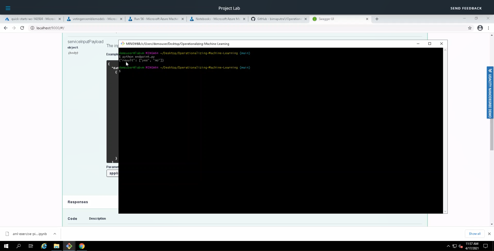

# Operationalizing Machine Learning in Azure

## Overview
In this project we aim to predict if a client will subscribe into bank services or not. The prediction was based on various independent variables from the customers which can be found in this [Bankmarketing Dataset](https://automlsamplenotebookdata.blob.core.windows.net/automl-sample-notebook-data/bankmarketing_train.csv). We build an end to end solution from dataset preparation, model training, deployment, and model monitoring. In addition, we also create a pipeline to automate the process in Azure ML Studio.

## Architectural Diagram

## Key Steps

### Step 1 Authentication
In this step, we used lab provided by Udacity. So, we dont need to setup the authentication.

### Step 2 Automated ML Experiment

This step start with uploading [Bankmarketing Datset](https://automlsamplenotebookdata.blob.core.windows.net/automl-sample-notebook-data/bankmarketing_train.csv) into the Azure ML Studio. 

  
*Figure 1: Bank Marketing Dataset*

After that, I used the data to performed Automated Machine Learning Experiment using Classification with **y** as a target variable. This variable show that the customer will subscribe or not into the bank services.

  
*Figure 2: Automated ML Running*

As a result, the best model for this experiment is VotingEnsemble with 91.87 % model accuracy.

  
*Figure 3: Automated ML Results*

### Step 3 Deploy the best model

In this step, the VotingEnsemble model was deployed. This deployment will allow interaction with the HTTP API service and interact with the model by sending the data over POST request. The deployment was using the Azure Container Instance (ACI) and enabling the authentication.

  
*Figure 4: Model Successfully deployed*

*Figure 5: Deployed model details*

### Step 4 Enable logging

In this step we enable logging by enabling application insight service. Application Insights is a very useful tool to detect anomalies and visualise performance. We enable this by running `logs.py` script.

*Figure 6: Log from Logs.py*

*Figure 7: Application Insight enable status*

### Step 5 Swagger Documentation
Swagger is a great tool to manage API. This tools can helps to develop, document, and share API. To enable this service, we run `swagger.sh` and `serve.py` script.

*Figure 8: Swagger Documentation*

Here the HTTP POST request format to call the API

*Figure 9: API call format*

### Step 6 Consume model endpoints

Now, we can interact with the model by calling an API using above format.

*Figure 10: API call format*

Here, we send to data and get response Yes and No for the first and second data.

### Step 7 Create and publish a pipeline

In this step, we create an automatedML pipeline in Jupyter Notebook. This include creating the train pipeline and endpoint pipeline.

*Figure 11: Running Notebook*

*Figure 12: Created pipelines*

*Figure 13: Pipelines Endpoint*

*Figure 14: Published Pipelines* 

## Video Link
This is the video link related to this project: https://youtu.be/fbsF0wY7Lrw

## Opportunity for Improvements
- Treating the Imbalance Dataset
- Tuning hyperparameter
- Testing different modelling approach like using deep learning.